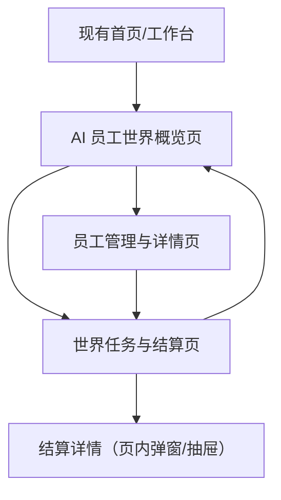

## 1. Product Overview
在现有项目中新增“AI 模块”，提供“AI 员工世界”玩法：你招募与培养 AI 员工，在世界地图中执行任务/处理事件，获取资源并推进世界进度。
目标是形成可重复的“招募 → 派遣 → 结算 → 成长 → 解锁”的核心循环，成为现有产品的长期留存玩法入口。

## 2. Core Features

### 2.1 User Roles
| 角色 | 注册方式 | 核心权限 |
|------|----------|----------|
| 已登录用户 | 复用现有项目登录体系 | 进入 AI 模块；管理 AI 员工；进行世界派遣与结算；查看记录与奖励 |

### 2.2 Feature Module
我们的“AI 模块 / AI 员工世界”需求由以下核心页面构成：
1. **AI 员工世界概览页**：世界进度与今日状态、资源总览、员工列表与快捷派遣入口、最近事件/结算摘要。
2. **员工管理与详情页**：员工属性与特质、培养升级、装备/技能配置、可用任务适配提示。
3. **世界任务与结算页**：任务列表与筛选、队伍编成/派遣、模拟执行进度、事件流展示、结算奖励与日志。

### 2.3 Page Details
| Page Name | Module Name | Feature description |
|-----------|-------------|---------------------|
| AI 员工世界概览页 | 入口与导航 | 从现有主导航进入 AI 模块；展示当前世界名称/赛季与进度；提供“去任务”“去员工”快捷入口 |
| AI 员工世界概览页 | 资源面板 | 展示核心资源（例如能量/金币/材料/声望等的通用抽象）；显示今日可用次数/体力；提示资源变化（+/-） |
| AI 员工世界概览页 | 员工列表（摘要） | 展示员工头像/等级/状态（空闲/派遣中/疲劳）；支持按状态与稀有度（或品质）快速筛选；支持一键进入员工详情 |
| AI 员工世界概览页 | 最近结算与事件 | 展示最近一次派遣的结算摘要（任务、收益、关键事件）；支持进入任务结算详情 |
| 员工管理与详情页 | 员工档案 | 展示员工基础信息（名称、等级、定位/职业、特质标签）；展示核心属性与战力/综合评分（用作任务适配） |
| 员工管理与详情页 | 培养升级 | 消耗资源升级；展示升级收益与消耗；当资源不足时给出缺口提示 |
| 员工管理与详情页 | 配置（技能/装备位） | 配置有限槽位（如技能/装备/道具位的抽象）；保存配置并立即影响任务表现；展示与当前常用任务的匹配度提示 |
| 世界任务与结算页 | 任务列表 | 展示可执行任务（难度、推荐属性、耗时/消耗、预期收益）；支持按难度/收益/推荐属性排序与筛选 |
| 世界任务与结算页 | 队伍编成与派遣 | 选择 1-N 名员工组成队伍；校验派遣条件（体力/空闲/门槛）；确认后进入“执行中”状态并锁定相关员工 |
| 世界任务与结算页 | 执行与事件流 | 在执行过程中展示关键节点事件（成功/失败/分支选择的抽象）；支持查看事件详情（时间点、影响、涉及员工） |
| 世界任务与结算页 | 结算与日志 | 结束后展示奖励明细、资源变动、员工成长/疲劳变化；生成可回看日志记录（用于复盘与分享的基础信息） |

## 3. Core Process
### 3.1 核心玩法循环（你的操作视角）
1) 进入 AI 模块查看世界状态与资源 → 2) 招募/选择员工并进行培养与配置 → 3) 在任务列表中选任务并编成队伍 → 4) 派遣执行，过程中产出事件流与结果 → 5) 结算获得资源/员工成长/世界进度 → 6) 用收益继续培养并解锁更高难度任务，循环进行。

### 3.2 关键流程
- 派遣流程：选择任务 → 选择员工 → 条件校验（空闲/体力/门槛）→ 创建本次执行记录 → 展示执行事件流 → 结算 → 写入奖励与日志。
- 培养流程：进入员工详情 → 选择升级/配置 → 校验资源 → 保存 → 返回任务页获得更高适配与更好收益。

