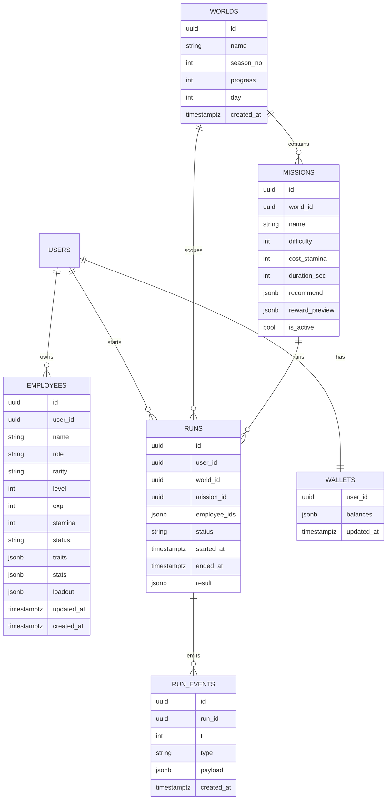

## 1.Architecture design
```mermaid
graph TD
  A["User Browser"] --> B["React Frontend Application（沿用现有项目框架）"]
  B --> C["Supabase JS SDK"]
  C --> D["Supabase Auth"]
  C --> E["Supabase Database (PostgreSQL)"]
  C --> F["Supabase Realtime（可选：任务/结算状态推送）"]

  subgraph "Frontend Layer"
    B
  end

  subgraph "Service Layer (Provided by Supabase)"
    D
    E
    F
  end
end
```

## 2.Technology Description
- Frontend: React@18 + TypeScript +（沿用现有路由/构建体系）+ tanstack/react-query（或等价方案）+ zustand（或等价方案）
- Backend: Supabase（Auth + PostgreSQL + Realtime 可选）

## 3.Route definitions
| Route | Purpose |
|-------|---------|
| /ai | AI 员工世界概览：世界进度/资源/员工摘要/最近结算 |
| /ai/employees/:id | 员工详情：属性、培养升级、配置保存 |
| /ai/world | 世界任务与结算：任务列表、编队派遣、事件流、结算日志 |

## 4.API definitions (If it includes backend services)
本方案不引入自建服务端 API；“接口”以 Supabase 表读写 + 前端领域服务函数形式定义。

### 4.1 Core TypeScript types（前端/数据库共用）
```ts
export type World = {
  id: string
  name: string
  season_no: number
  progress: number // 0~10000（抽象进度）
  day: number
  created_at: string
}

export type Employee = {
  id: string
  user_id: string
  name: string
  role: string // 职业/定位（抽象）
  rarity: string // 品质（抽象）
  level: number
  exp: number
  stamina: number
  status: 'idle' | 'running'
  traits: string[]
  stats: Record<string, number> // 例如 {"logic":10,"social":8}
  loadout: Record<string, string | null> // 槽位 -> 配置项
  updated_at: string
  created_at: string
}

export type Mission = {
  id: string
  world_id: string
  name: string
  difficulty: number
  cost_stamina: number
  duration_sec: number
  recommend: Record<string, number>
  reward_preview: Record<string, number>
  is_active: boolean
}

export type Run = {
  id: string
  user_id: string
  world_id: string
  mission_id: string
  employee_ids: string[]
  status: 'running' | 'settled' | 'cancelled'
  started_at: string
  ended_at: string | null
  result: Record<string, any> | null
}

export type RunEvent = {
  id: string
  run_id: string
  t: number // 秒级时间点
  type: string // 事件类型（抽象）
  payload: Record<string, any>
  created_at: string
}

export type Wallet = {
  user_id: string
  balances: Record<string, number>
  updated_at: string
}
```

### 4.2 Data Access Interfaces（前端领域服务函数建议）
```ts
// 世界概览
getWorldOverview(userId): Promise<{world: World; wallet: Wallet; employees: Employee[]; lastRun?: Run}>

// 员工
getEmployee(id): Promise<Employee>
upgradeEmployee(id, deltaLevel): Promise<Employee>
saveEmployeeLoadout(id, loadout): Promise<Employee>

// 任务与派遣
listMissions(worldId, filters): Promise<Mission[]>
createRun(input: {worldId; missionId; employeeIds}): Promise<Run>
appendRunEvents(runId, events: RunEvent[]): Promise<void>
settleRun(runId, settlement: {walletDelta; employeeDelta; worldDelta; summary}): Promise<Run>
```

## 5.Server architecture diagram (If it includes backend services)
不包含自建服务端；由前端直连 Supabase。

## 6.Data model(if applicable)

### 6.1 Data model definition


### 6.2 Data Definition Language
> 说明：避免物理外键约束，使用逻辑外键字段；可按项目现状补充 RLS 策略。

```sql
-- WORLDS
CREATE TABLE worlds (
  id UUID PRIMARY KEY DEFAULT gen_random_uuid(),
  name TEXT NOT NULL,
  season_no INT NOT NULL DEFAULT 1,
  progress INT NOT NULL DEFAULT 0,
  day INT NOT NULL DEFAULT 1,
  created_at TIMESTAMPTZ NOT NULL DEFAULT NOW()
);

-- MISSIONS
CREATE TABLE missions (
  id UUID PRIMARY KEY DEFAULT gen_random_uuid(),
  world_id UUID NOT NULL,
  name TEXT NOT NULL,
  difficulty INT NOT NULL DEFAULT 1,
  cost_stamina INT NOT NULL DEFAULT 1,
  duration_sec INT NOT NULL DEFAULT 60,
  recommend JSONB NOT NULL DEFAULT '{}'::jsonb,
  reward_preview JSONB NOT NULL DEFAULT '{}'::jsonb,
  is_active BOOLEAN NOT NULL DEFAULT TRUE
);
CREATE INDEX idx_missions_world_id ON missions(world_id);

-- EMPLOYEES
CREATE TABLE employees (
  id UUID PRIMARY KEY DEFAULT gen_random_uuid(),
  user_id UUID NOT NULL,
  name TEXT NOT NULL,
  role TEXT NOT NULL,
  rarity TEXT NOT NULL,
  level INT NOT NULL DEFAULT 1,
  exp INT NOT NULL DEFAULT 0,
  stamina INT NOT NULL DEFAULT 10,
  status TEXT NOT NULL DEFAULT 'idle',
  traits JSONB NOT NULL DEFAULT '[]'::jsonb,
  stats JSONB NOT NULL DEFAULT '{}'::jsonb,
  loadout JSONB NOT NULL DEFAULT '{}'::jsonb,
  updated_at TIMESTAMPTZ NOT NULL DEFAULT NOW(),
  created_at TIMESTAMPTZ NOT NULL DEFAULT NOW()
);
CREATE INDEX idx_employees_user_id ON employees(user_id);

-- RUNS
CREATE TABLE runs (
  id UUID PRIMARY KEY DEFAULT gen_random_uuid(),
  user_id UUID NOT NULL,
  world_id UUID NOT NULL,
  mission_id UUID NOT NULL,
  employee_ids JSONB NOT NULL DEFAULT '[]'::jsonb,
  status TEXT NOT NULL DEFAULT 'running',
  started_at TIMESTAMPTZ NOT NULL DEFAULT NOW(),
  ended_at TIMESTAMPTZ NULL,
  result JSONB NULL
);
CREATE INDEX idx_runs_user_id_started_at ON runs(user_id, started_at DESC);

-- RUN_EVENTS
CREATE TABLE run_events (
  id UUID PRIMARY KEY DEFAULT gen_random_uuid(),
  run_id UUID NOT NULL,
  t INT NOT NULL,
  type TEXT NOT NULL,
  payload JSONB NOT NULL DEFAULT '{}'::jsonb,
  created_at TIMESTAMPTZ NOT NULL DEFAULT NOW()
);
CREATE INDEX idx_run_events_run_id_t ON run_events(run_id, t);

-- WALLETS
CREATE TABLE wallets (
  user_id UUID PRIMARY KEY,
  balances JSONB NOT NULL DEFAULT '{}'::jsonb,
  updated_at TIMESTAMPTZ NOT NULL DEFAULT NOW()
);

-- Permissions (baseline)
GRANT SELECT ON worlds, missions TO anon;
GRANT ALL PRIVILEGES ON worlds, missions, employees, runs, run_events, wallets TO authenticated;
```

## 状态流（关键：派遣与结算）
```mermaid
graph TD
  A["/ai/world 选择任务与员工"] --> B["前端校验：空闲/体力/门槛"]
  B --> C["写入 runs(status=running)"]
  C --> D["锁定员工状态 employees.status=running & stamina 预扣"]
  D --> E["前端本地模拟/推进事件（按种子）"]
  E --> F["批量写入 run_events"]
  F --> G["结算：更新 wallets/员工成长/世界进度"]
  G --> H["runs.status=settled & 写入 result"]
  H --> I["UI 展示结算与日志，可回看"]
end
```
